# Data Engineering Lesson Learn
This is collection of projects, practices in data engineering foundation

## Introduction & Goals
- Summary fundamental skills, knowledge of a Data Engineer.
- Strengthen theory by practical exercises.

## Table of contents
- [Data engineering foundations](#def)
- [Python for data engineer](#py4de)
- [SQL intensive](#sqlintensive)
- [Platform and Pipeline design foundations](#platform&pipelinedesign)
- [Database intensive](#schemadesign)
- [Fundamental tools](#fundamentaltools)
- [Data architect](#daa)

## A. Data engineering foundations 
- Diagrams:
  - UML diagram
  - Sequence diagram
- Source version control:
  - Github
  - Gitlab
- [Agile](https://www.visual-paradigm.com/guide/uml-unified-modeling-language/uml-class-diagram-tutorial/)
  - Roles:
    - Product owner
    - Development team
    - Scrum master
  - Activities:
    - Sprint retro
    - Sprint planning
    - Daily scrum
    - Sprint review
- [DevOps](https://intland.com/codebeamer/devops-it-operations/)
- [SRE](https://sre.google/books/)
- [OLAP vs OLTP](https://www.guru99.com/oltp-vs-olap.html)
- Relational database and SQL are important
- [Data modeling](https://www.guru99.com/data-modelling-conceptual-logical.html)
- [ER model](https://www.tutorialspoint.com/dbms/er_model_basic_concepts.htm)
  - Entity:
    - Entity set
    - Keys:
      - Super key
      - Candidate key
      - Primary key
  - Attributes:
    - Simple attribute
    - Composite attribute
    - Derived attribute
    - Single-value attribute
    - Multi-value attribute
  - Relationship:
    - Relationship set (descriptive attributes)
    - Degree of relationship
      - Binary = degree 2
      - Ternary = degree 3
      - n-ary = degree n
    - Mapping cardinalities
      - One-to-one
      - One-to-many
      - Many-to-one
      - Many-to-many
- [Normalization](https://www.edureka.co/blog/normalization-in-sql/)
  - 1NF, 2NF, 3NF, 4NF
- Primary key and Foreign key
- Building a data model with [dbdiagram.io](https://dbdiagram.io/d)
- Computer networking:
  - Networking basic
  - IP address and subnet mask
  - IP routing
  - Vlans
  - Access control list
  - VPN
  - Ports
  - TCP/UDP
  - Public/private key exchange/ security explained
  - Security Certificate & CAs
- Linux:
  - Important directories /var/log /var/opt /etc /tmp
  - Copy and move data
  - Cronjobs
  - Vi/vim/nano visual editors on command line
  - Bash/shell script
  - Permission
- REST API
  - [API design](https://cloud.google.com/apis/design)
  - [Swagger](https://swagger.io)

## B. Python for data engineer 
- Advanced Python:
  - Class
  - Modules
  - Exception handling
  - Logging
- Data engineering
  - Work with Datetime format
  - Work with JSON format
    - Load, dump
    - Serialize, deserialize with Pydantic
    - Validation with [json-schema](https://json-schema.org/draft/2020-12/json-schema-validation.html#name-introduction), [syntax](https://opis.io/json-schema/2.x/formats.html#:~:text=invalid-,date%2Dtime,%3A%3ADDThh%3Amm%3Ass.)
  - Testing
    - [pytest structure](https://blog.methodsconsultants.com/posts/pytesting-your-python-package/)
  - **Pandas**:
    - Read from csv
    - Working with data types
    - Reading from JSON
    - Appending dataframes
    - Merging dataframes
    - Pivoting dataframes
    - Saving and reading parquet
    - **Melting and normalization (JSON)**
    - Average, min, max of columns in dataframe
    - Add random value to dataframe
  - Work with data source/sink
    - Work with REST API
    - Work with database
      - Setup
      - Table
      - Bulk load
      - Query

## C. SQL intensive 

## D. Platform and Pipeline design foundations 
### 1. The platform blueprint
- Sources
  - External API
  - External data warehouse
  - External SQL/No-SQL database
- Temporary storage - buffer
  - Cache
  - Message queue
- Processing
  - Batch processing
  - Stream processing
- Persistence storage
  - SQL database
  - No-SQL database
  - DWH
  - OLAP
- Ingestion pipelines
  - Push ingestion pipeline
  - Pull ingestion pipeline
- Batch pipelines
  - Store
  - Processing framework (ELT/ELT)
  - Scheduling
  - Workflow orchestration
- Stream pipelines
  - For ingestion purpose (push ingestion pipeline)
  - Stream analytic
    - Seed only small window
    - Immediately processing
    - Preprocessing on the fly
    - Push result to
      - Buffer
      - Storage
- [**Lambda architecture**](https://hazelcast.com/glossary/lambda-architecture/)
  - Kafka -> Spark streaming -> [Store 1 for batch, Store for stream]
  - Airflow -> Spark processing/Python script -> Store 1 -> Store 2
  - Dashboard -> Store 2
  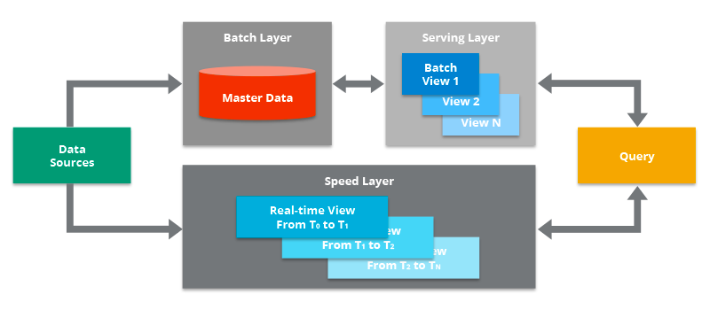
  
- [**Kappa architecture**](https://hazelcast.com/glossary/kappa-architecture/)
  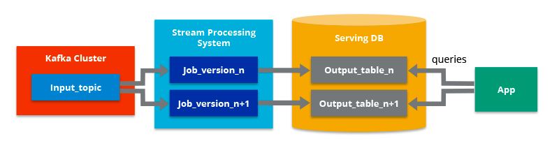

- Data visualization pipelines
  - Data store
    - Operational database
    - No-SQL database
    - Data warehouse
  - Visualization tools (BI tools, Web UI, Dashboard)
  - API access data from store
  - Open-gateway data publish to subscribers
- Machine learning pipelines
- Platform examples (AWS, Azure, GCP, Hadoop)
  - AWS
  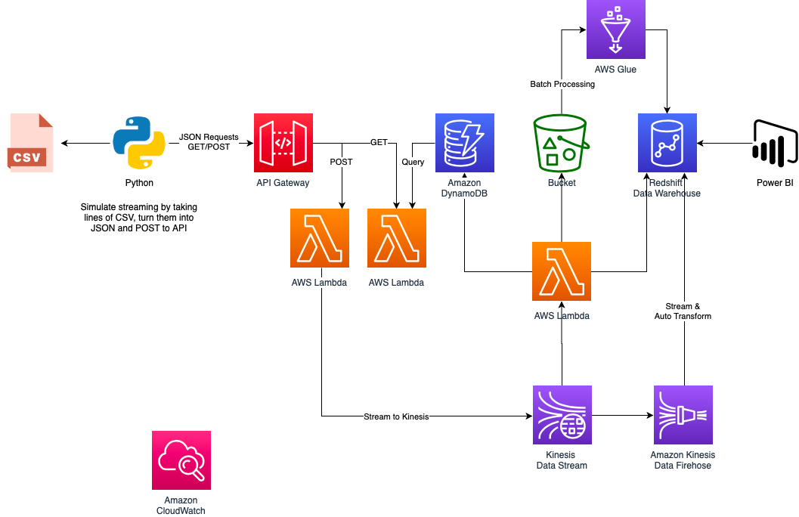
  - Azure (Source: )
  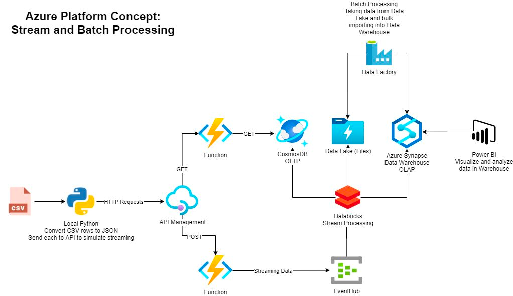
  - GCP
  - Hadoop
    
### **Platform pipeline security**
  - Network security:
    - [Network, Firewall, Access Control List (ACL)](https://www.geeksforgeeks.org/computer-network-tutorials/?ref=lbp)
    - [Proxy servers](https://devopscube.com/setup-and-configure-proxy-server/)
    - [Bastion hosts](https://www.youtube.com/watch?v=cfOaMeIv_Fk)
  - Access management:
    - Identify and access management
      - Identity management answers "who am I?"
      - Access management answers "what is my role?"
    - Lightweight Directory Access Protocol (LDAP)
      - [Squid LDAP](https://workaround.org/squid-ldap/)
      - [Openldap](https://www.openldap.org/)
      - Connection process:
        - Connect: client make a request for connection to server
        - Bind (anonymous or login): client send authentication information
        - Search: client send to server it's search requirement
        - Interpret search: sever search information requested
        - Result: server response to client
        - Unbind: client send request for closing connection
        - Close connection: close connection totally
  - Data transmission security
    - HTTPS, SSH, SCP
    - Tokens
      - [OAth 2.0 with Okta](https://www.oauth.com/)
      - [Twitter Authentication](https://developer.twitter.com/en/docs/authentication/overview)
        

### **Choosing data store**
- Data store basics
  - OLTP vs OLAP
  - ELT vs ELT
  - [Data store library]
  
| Spec          | OLTP                        | OLAP                                |
|---------------|-----------------------------|-------------------------------------|
| Use case      | Main business purpose       | Business Intelligence               |
| Structure     | Very structured (normalize) | Less structure (denormalize)        |
| Ingestion     | Transactional               | Data gets copied in                 |
| Size of piece | Small transaction           | Insight into larger amounts of data |
| Users         | User interfaces             | Access by Analysts by BI tools      |
| Down stream   | Other systems               | Data source for ML applications     |

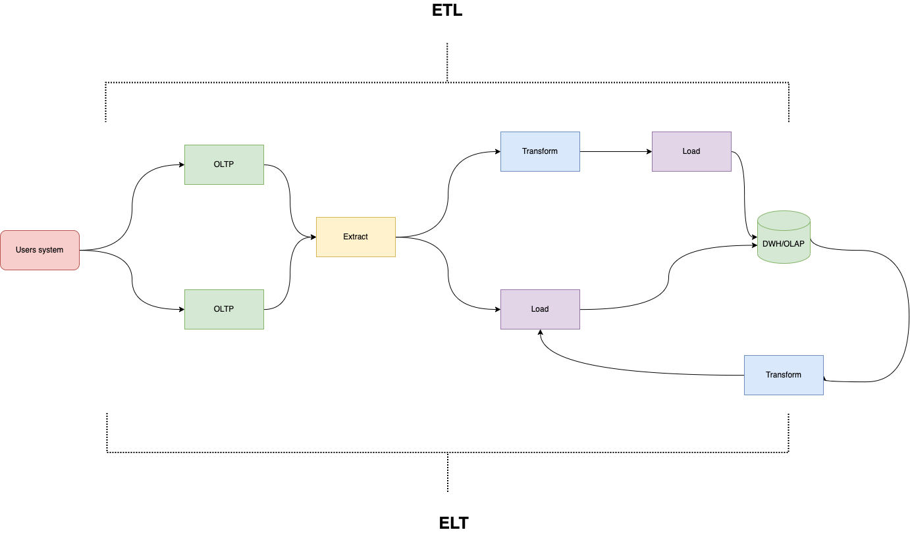
  - **Relational database**
    - Very structured (Schema at design)
    - Table with columns and rows
    - Relationship between tables (primary key and foreign key)
    - SQL language for queries
    - CRUD (create, read, update, delete)
    - ACID
      - Atomic: all or nothing (commit and rollback)
      - Consistency: data will be valid
      - Isolation: transaction will not affect each others
      - Durability: if it is in the system, it will be in the system
    - Examples: MSSQL, MySQL, PostgreSQL, Oracle
  

  - **NoSQL database**
    - Basics
    - Document stores:
      - **Often JSON documents**
      - Store information together in one documents
      - Second model often document indexing
      - Big upside compared to index of relational databases
      - Examples:
        - MongoDB
        - DynamoDB
        - CosmosDB
    - Time Series Databases:
      - Perfect for storing **high frequency time based measurement**
      - Simple query model for visualizing on dashboard
      - Fast read and write speed
      - Hotspoting is dangerous
      - Big upside compared with timestamp index on relational databases
      - Examples:
        - InfluxDB
        - TimescaleDB
        - OpenTSDB
    - Search engine:
      - Indexing of documents (JSON)
      - Very fast and versatile
      - Great for logging and monitoring compared with log file
      - ELK(Elasticsearch - Logstash - Kibana) is a well-known stack includes 
      visualization tool
      - Examples:
        - Elasticsearch
        - Spunk
        - Solr
    - Wide column stores:
      - Main purpose for changing and dynamic schema
        - Columns are not predefined
        - Columns can change with every row
        - Millions columns are possible
      - Indexing is harder than with document store
      - Examples:
        - Apache Cassandra
        - Bigtable
        - Scylla
    - Key-value stores:
      - Very simple store (just key and value)
      - Quick read/write performance
      - Slow random read performance
      - Key often sorted for speeding up sequential reading
      - Examples:
        - Redis
        - KeyDB
        - Memcached
    - Graph databases
      - Store nodes and relationships instead of tables or documents
      - When we think connections between items as the important as the items themselves.
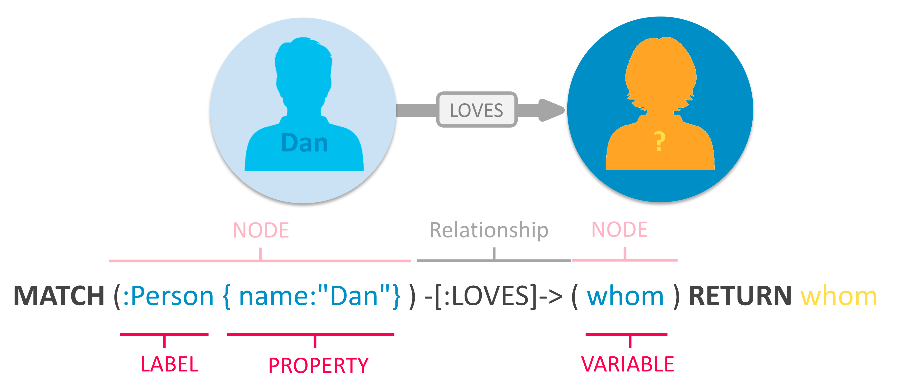

    (source: _https://neo4j.com/developer/graph-database/_)
  - **Data Warehouses**
    - Used for analytical insight by data analysts or domain experts
    - Usually visualize by BI tools
    - Tabular structure makes them easy to use by SQL and JOIN
    - [Star, snowflake and galaxy schema](https://www.guru99.com/star-snowflake-data-warehousing.html)
    - Dimensional modeling with dimensional and fact table
    - Often no "transaction" and ACID tradeoffs
    - Not used as operational databases
    - Examples:
      - Hive
      - Redshift
      - Bigquery
      
  - **Data Lake:**
    - Raw data storage, usually files (json, parquet, csv, txt,....)
    - High performance and storage size friendly
    - Hard to random query then use for data warehouse or processing framework (Spark)
    - Data catalogues like AWS Glue help to prevent data lake become data swamps
    - Examples:
      - AWS S3
      - Google cloud storage
      - HDFS (Hadoop Distributed file system)

## E. Data schema design 
  - Why schema design is important
    - Schema help user to ensure quality of data not related to what kind 
of data store (relational or No-SQL)
    - Help organization achieve the goal of business
    - Prevent to generate a data swamp
  - Entity relationship diagram
  - Schema in wide column store
  - Schema in document store
  - Schema in key-value store
  - Data warehouse fact and dimension modeling

### Database Taxonomy

- Data Model
  1. Relational
  2. Hierarchical
  3. Network
  4. Document
  5. Dimensional

- Storage Medium	
  1. In-memory database
  2. Disk-based database

- Disk Layout
  1. Row oriented
  2. Column oriented

- Access pattern
  1. OLTP
  2. OLAP 

### Core Components of Databases

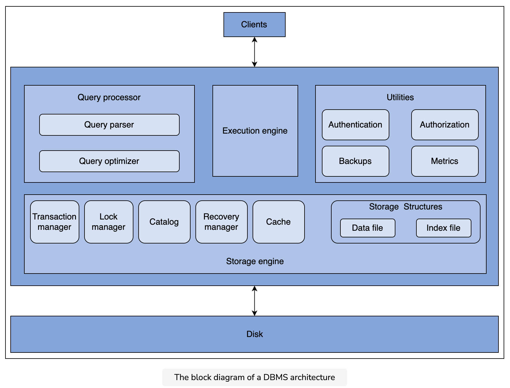

- Query processor: the query processor is responsible for receiving the user input and translating it into an execution format suitable for the execution engine. The query processor includes two submodules:
  - Query parser
  - Query optimizer

- The execution engine receives the execution plan from the query processor and executes it to fulfill the user input.
- Storage engine: the storage engine is the core module of DBMS. It is responsible for handling the storage and recovery of data in the database and facilitating access and manipulating data in the filesystem:
  - The transaction manager is responsible for coordinating one or more operations on the data structures part of the storage structures module. It ensures that the entire sequence of operations is either executed successfully or rolled back, leaving no partial updates
  - The lock manager is responsible for holding lock objects on database entities for currently executing database operations and ensures that concurrently running processes do not overwrite each other's values. This provides consistency and predictability.
  - Storage structures: Storage structures are the data structures laid out on the disk or memory for storing data for efficient retrieval and manipulation.
  - Cache manager: a cache manager (also called a buffer manager) to cache disk pages in the main memory for faster lookups and to reduce disk access requests
  - The recovery manager maintains an append-only data structure that stores every write operation applied to the DBMS in a log file for recovery. The recovery manager serves as a persistent intermediate store for all write requests.
  - The catalog is a metadata store containing schema definitions of various database objects and indexes, users and their roles, and statistical information such as index cardinality and data placement.

## F. Fundamental tools 
### Apache Spark fundamentals
  - Scaling:
    - Resources
      - Vertical:
        - Increase CPU capacity (number of cores / processor)
        - Increase memory (RAM, Buffer)
        - Increase storage
      - Horizontal:
        - Increase number of machines
    - Computing ability:
      - Parallel processing
      - Sequential processing
      - Concurrency processing
  - What is Spark good for?
    - Batch processing in huge (BT/TB/PB) dataset
    - Stream processing with message queues like Kafka
    - Processing data on Hadoop
    - Various datatype of input
      - CSV
      - JSON
      - Parquet
      - Hadoop
      - ODBC connection
      - REST calls
      - AWS S3
      - Google cloud storage
      - Kafka
      - ....
    - Processing data on memory instead of disk
  - [Spark cluster overview](https://spark.apache.org/docs/latest/cluster-overview.html):
    - Spark executor (worker)
      - Run task on its node
    - Spark driver + context
      - Schedule task on executors
      - Context is main entrypoint
    - Spark cluster manager
      - Manage resource of clusters
  

  - Cluster types:
    - **Standalone**: basic cluster manager that comes with Spark
    - **Kubernetes**: managers for deploying containerized applications
    - **Hadoop YARN**: main resource manager of Hadoop cluster
    - **Apache Mesos (Deprecated)**: manager for running Hadoop MapReduce
  
  - Client and cluster management:
    - Client:
      - Driver & Context lives inside the client
      - Driver connect to and schedule task on executors 
      - Jobs shutdown when client quit
      - Spark acquires executor from resource manager
      - Good for developing, debug
    - Cluster
      - Driver lives inside Spark application master
      - Independent of starting application
      - Production environment
  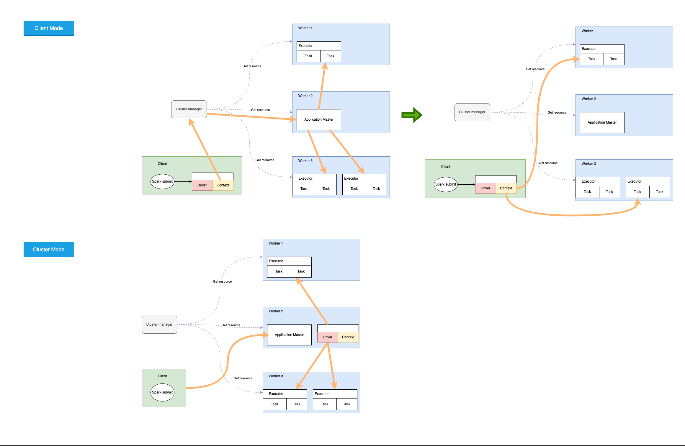

  - Where to run Spark:
    - **Standalone**
    - Hadoop
    - AWS EMR/Glue
    - Google cloud Dataproc
    - Azure HDInsight
  - Transformation and Action:
    - Transformation
      - Will create a new dataframe
      - Do not send data back to the driver
      - RDD is immutable
      - Schema is defined eagerly
      - Transformation is executed lazily parallel
      - Two types:
        - Narrow transformation:
          - All records in a single partition of parent are processed
          - Functions:
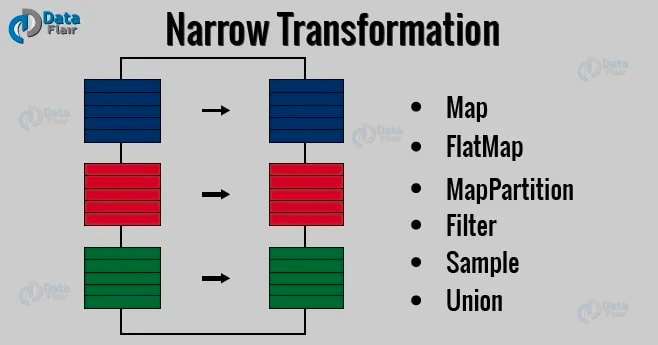
        - Wide transformation:
          - All records in many partitions of parent are processed
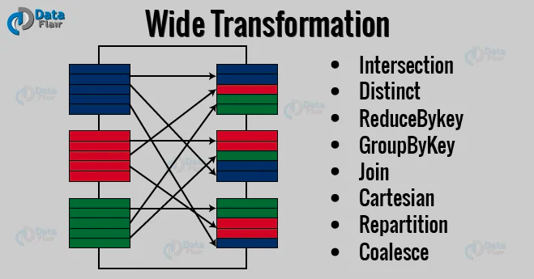
    - Action:
      - Send data back to the driver
      - Action is executed eagerly
      - Action compute the transformations of dataframe -> output 
      - Query = transformation + action
      - Actions:
        - count()
        - first()
        - take(n)
        - collect()
        
## G. Data Architect
### What should we concern
- Storage
- Software
- Data flow
- Interfaces
- Data sources
- Transformations
- Staging areas
- Operational Data Store
- Data warehouse
- Reporting
- ML product
### Artifacts of an Enterprise Data Architecture
- Data dictionary: helps to standardize business vocabulary
- Enterprise data models: used to create an ODS (Operational Data Store).
- Data flow: enable a smooth transition of data movements crossing various silos. We will discuss data flows later in the course
- Data stewardship: specifies who can access what data
- Dimensional models: used to create a data warehouse structure for effective reporting and analytics
- Data sharing agreements: articulate who can access what data

### Typical dataflow for a good architecture
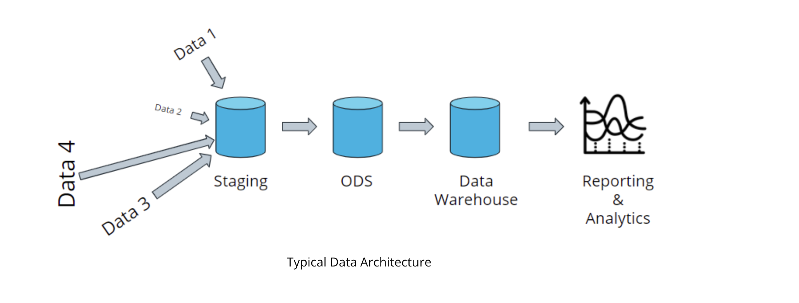

