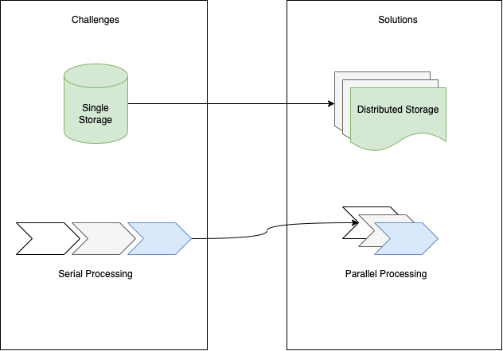

## Table of contents
- [A. Challenges of Storing in Big Data](#challenges)
  - Harvest story 
  - Mapping to big data problem
- [B. Distributed File System (DFS)](#dfs)
  - Definition
  - Advantages of DFS 
  - Disadvantages of DFS
  - Characteristics of a DFS
  - Common Technologies for DFS 
- [C. Hadoop Distributed File System](#hdfs)
- [D. References](#ref)

## A. Challenges of Storing in Big Data <a name="challenges"></a>

### 1. Harvest story
```commandline
In the small village, there is a farmer, his name is Jack. Every scrop Jack harvest grapes then sell them in the nearby 
town. After harvesting, he stores the product in a storage room. Day by day, the nearby town develops quickly leads 
to the high demand for other fruits. So he began growing and harvesting apples and oranges as well. He then realized 
that it is time-consuming and difficult to harvest all of the fruits by himself. So, he decided to hire two other 
farmers who are his neighborhoods to work with him. With this, the harvesting is done simultaneously. Now his storage 
room became a bottleneck for storing and accessing the fruits in a single storage area because the path to that is wide 
enough for all activities to happen at the same time. Finally, Jack decided to distribute the storage area and give each
one of them in separate storage space. Someday a businessman came and say "Hello I want a fruit basket of 3 grapes,
2 apples and 4 oranges". To complete the order on time, all of them work parallelly with their own separate storage area. 
This storage solution helps them get tasks done without any hassles. All of them are happy and prepared for an increase 
in demand in the future.
```

(Source: Simplilearn: What is Hadoop?)

### 2. Mapping to big data problem

Earlier with limited data, only one processor and one storage unit are needed. 
When the data become more and more "big" (volume, velocity, variety" by data generators. 
At that time the single storage becomes so stressful. The solution is to distribute the storage for each processor this enables easy access to store and retrieve data. 

## B. Distributed File System (DFS) <a name="dfs"></a>

### 1.Definition

In computing, a distributed file system (DFS) or network file system is any file system that allows access to files from multiple hosts sharing via a computer network. This makes it possible for multiple users on multiple machines to share files and storages resources. Distributed file systems differ in their performance, the mutability of content, handling concurrent writes, handling of permanent or temporary loss of nodes or storage, the policy of storing content.

_(Source: Wikipedia: Comparision of the distributed file system)_

### 2. Advantages of DFS
- A vast of advantages we can find on Google 
### 3. Disadvantages of DFS
- Costing: if data reside on cloud storage and is consumed elsewhere, cloud egress charges may be significant.
- Network latency when assessing a non-cached portion of data.
- Complex to deploy and maintain on production
### 4. Characteristics of a DFS
- High IOPS/great small file performance.
- Cross protocol blocking: prohibits a file from being corrupted by multi-host access even accessing files with different protocols.
- Cloud resilient service.
- High availability support.
- (File) data reduction.
- Data-at-rest-encryption.
- Geo-fencing: some DFS can limit or restrict physical location.

### 5. Common Technologies for DFS
| Name                                                                                                              | Describe                                                                                                                                                                  | Owner                      |
|-------------------------------------------------------------------------------------------------------------------|---------------------------------------------------------------------------------------------------------------------------------------------------------------------------|----------------------------| 
| [Ceph](https://ceph.com/en/)                                                                                      | POSIX compatible; supports data migration,re-replication when a host goes down                                                                                            | Ceph foundation            | 
| [Coda](http://www.coda.cs.cmu.edu/about.html)                                                                     | --------                                                                                                                                                                  | Carnegie Mellon University | -------         |
| [The GNU Cluster FileSystem (GlusterFS)](https://www.gluster.org/)                                                | No rebalancing or automated replication files are stored as whole files. Not as distributed chunks there are problems with bringing an old file store online	Cluster Inc. | Cluster Inc.               |
| [Google file system](https://static.googleusercontent.com/media/research.google.com/en//archive/gfs-sosp2003.pdf) | Clearly, anyone can’t just “use” this, but it deserves to be on the list because of its design principles, and for comparison	                                            | Google                     |
| [Hadoop file system](https://hadoop.apache.org/docs/r1.2.1/hdfs_design.html)                                      | Run-on commodity hardware. Highly a fault-tolerant and is designed to be deployed on low-cost hardware.	| Apache Software Foundation |  |

_Source: http://jehiah.cz/a/distributed-filesystems_

## D. Hadoop Distributed File System <a name="hdfs"></a>
## E. References <a name="ref"></a>:
- [Big Data Does it Call for Distributed File System](https://www.researchgate.net/publication/291019706_Big_Data_Does_it_Call_for_Distributed_File_System)
- [Distributed File Systems](https://www.sciencedirect.com/topics/computer-science/distributed-file-systems)


