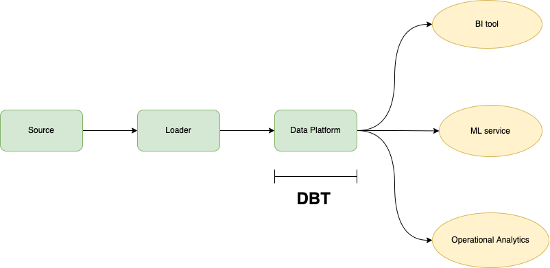

# DBT INTENSIVE


## Table of contents
- A. What is dbt? and Why does it matter?
- B. Setup dbt
- C. Core concepts
- D. Use cases
- E. Q&A

## A. What is dbt
db is an open-source command line tool which help analysts and 
engineers transform data in their data warehouse more effectively.


### Modern data stack and dbt

## B. Setup dbt 

## C. Core concepts
### 1. Model
- What is model:
   - Shape of the schema of final table after transforming
   - In dbt model will be formed by SELECT statement which localted in .sql files
- Modularity:
   - We could build each of our final models in a single model as we did with dim_customers, however with dbt we can create our final data products using modularity.
   - Modularity is the degree to which a system's components may be separated and recombined, often with the benefit of flexibility and variety in use.
   - This allows us to build data artifacts in logical steps.
   - For example, we can stage the raw customers and orders data to shape it into what we want it to look like. Then we can build a model that references both of these to build the final dim_customers model.
   - Thinking modularly is how software engineers build applications. Models can be leveraged to apply this modular thinking to analytics engineering.
- Materializations:
   - View: your model is rebuilt as a view on each run, via a create view as statement.
   - Table: your model is rebuilt as a table on each run, via a create table as statement.
   - Incremental: incremental models allow dbt to insert or update records into a table since the last time that dbt was run.
   - Ephemeral: ephemeral models are not directly built into the database. Instead, dbt will interpolate the code from this model into dependent models as a common table expression.
- Model naming convention:
   - Sources (src) refer to the raw table data that have been built in the warehouse through a loading process. (We will cover configuring Sources in the Sources module)
   - Staging (stg) refers to models that are built directly on top of sources. These have a one-to-one relationship with sources tables. These are used for very light transformations that shape the data into what you want it to be. These models are used to clean and standardize the data before transforming data downstream. Note: These are typically materialized as views.
   - Intermediate (int) refers to any models that exist between final fact and dimension tables. These should be built on staging models rather than directly on sources to leverage the data cleaning that was done in staging.
   - Fact (fct) refers to any data that represents something that occurred or is occurring. Examples include sessions, transactions, orders, stories, votes. These are typically skinny, long tables.
   - Dimension (dim) refers to data that represents a person, place or thing. Examples include customers, products, candidates, buildings, employees. Note: The Fact and Dimension convention is based on previous normalized modeling techniques.
### 2. Source
- Sources represent the raw data that is loaded into the data warehouse.
- We can reference tables in our models with an explicit table name (raw.jaffle_shop.customers).
- However, setting up Sources in dbt and referring to them with the source function enables a few important tools.
- Multiple tables from a single source can be configured in one place.
- Sources are easily identified as green nodes in the Lineage Graph.
- You can use dbt source freshness to check the freshness of raw tables.

- Configuration and select from source
```yaml
version: 2
sources:
  - name: stripe
    schema: stripe
    tables:
      - name: payment
```

```
select
    orderid as order_id,
    amount / 100 as amount,
    status
from {{ source('stripe', 'payment') }}
````

- Source freshness
```yaml
version: 2

sources:
  - name: stripe
    schema: stripe
    tables:
      - name: payment
        loaded_at_field: _batched_at
        freshness:
            warn_after: {count: 12, period: hour}
            error_after: {count: 24, period: hour}
```

- Run freshness:
```commandline
$ dbt source freshness
```
### 3. Test
### 4. Document
### 5. Deployment


## D. Use cases

## E. Q & A
**1. What technological changes have contributed to the evolution of Extract-Transform-Load (ETL) 
to Extract-Load-Transform (ELT)?**
   - Modern cloud-based data warehouses with scalable storage and compute
   - Off-the-shelf data pipeline/extraction tools (ex: Stitch, Fivetran)
   - Self-service business intelligence tools increased the ability for stakeholders to access and analyze data

**2. dbt is part of which step of the Extract-Load-Transform (ELT) process?**
   - Transform

**3. Which one of the following is true about dbt in the context of the modern data stack?**
   - dbt connects directly to your data platform to model data
   
**4. Which one of the following is true about YAML files in dbt?**
   - YAML files are used for configuring generic tests

5. What is required to materialize a model in your data platform with dbt?
   -  