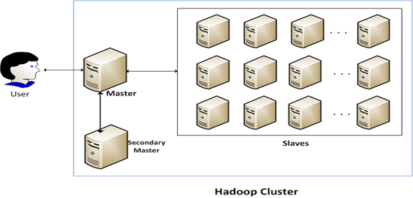
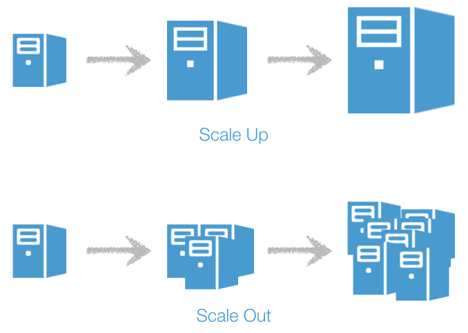

# Tổng quan về Hadoop (Part 1)

- Trong bài viết này, mình sẽ giới thiệu về Hadoop để từ đó bạn có thể hiểu được Hadoop là gì, tại sao phải cần có Hadoop, nó có những thành phần gì và nó được sử dụng trong những trường hợp nào ?

- Trước khi đi vào Hadoop, mình sẽ nói sơ về BigData vì đây là vấn đề mà phát sinh ra Hadoop, hay có thể nói là Hadoop ra đời để giải quyết cho bài toán liên về BigData. Vậy Bigdata là gì ?

## Bigdata là gì ?
- Trước khi Internet phát triển, dữ liệu của người dùng không lớn nên việc xử lý tính toán trên tập dữ liệu này thường được một server xử lý. Và nếu dữ liệu có tăng lên mà với một con server hiện tại không đáp ứng được, chỉ cần thay thế một con server mới với cấu hình lớn hơn như RAM nhiều hơn, CPU cao hơn và Disk với dung lượng lớn hơn. 
- Và Khi Internet phát triển, bắt đầu phát sinh ra nhiều ứng dụng, mạng xã hội cùng phát triên theo, dẫn đến lượng dữ liệu càng ngày càng nhiều hơn và phát nhanh 1 cách chống mặt, có thể 1 ngày lượng người dùng sử dụng Facebook đã có thể phát sinh ra hàng ngàn Terabyte dữ liệu. Lúc đó việc lưu trữ xử lý dữ liệu trên 1 server không thể đáp ứng nổi, lúc này người ta cần một giải pháp để có thể giúp lưu trữ xử lý dữ liệu trên nhiều máy hơn. -> Thuật ngữ Bigdata ra đời.

  

> **Vậy Bigdata nó đơn giản là một thuật ngữ mà dùng để chỉ cho việc xử lý một tập dữ liệu lớn mà với ứng dụng truyền thống không thể xử lý được** 

### Data như thế nào gọi là dữ liệu Bigdata ?
- Ban đầu, để nói 1 dữ liệu là Bigdata thì nó sẽ có 3 đặt tính gọi là 3V (3 chữ cái đầu trong tiếng Anh của 3 từ: Volume, Velocity, Variety) 
  * Volume (Khối lượng): để chỉ kích thước của data mình, thường thì kích thước này tính bằng hàng ngàn Terabyte, có khi đến hàng trăm Petabytes (1TB = 1000GB, 1PB = 1000TB).
  * Velocity (Tốc độ): để nói rằng tốc độ data này phát triển rất nhanh và khả năng phát sinh theo thời gian thực (realtime)
  * Variety (Đa dạng): để chỉ rằng data này có thể có nhiều kiểu khác nhau như hình ảnh, video, text; Structured/Unstructured/semistructured.
- Nhưng sau này ra thêm nhiều đặt tính nữa như:
  * Veracity: để chỉ chất lượng và độ chính xác của data.
  * Value: để chỉ giá trị mà data đó mang lại (ví dụ như data chúng ta tự phát sinh ra để chơi không có ý nghĩa nhưng rất lớn nhưng giá trị mang lại từ data đó không có gì thì cũng không thể gọi là Bigdata)

> Vậy với việc Bigdata ra đời, chúng ta cần một giải pháp để giúp xử lý vấn đề Bigdata này. Từ đó có **Hadoop** ra đời

## Hadoop là gì ?

  

- Hiểu một cách đơn giản Hadoop là một **framework** mà cho phép chúng ta lưu trữ và xử lý dữ liệu trên nhiều server, tính năng này gọi là **distributed**. Có nghĩa là đối với người dùng khi nhìn vào hệ thống Hadoop chúng ta sẽ thấy nó giống như là 1 server mà có dung lượng lưu trữ lớn, Memory cao và CPU với rất nhiều cores nhưng bản chất bên dưới nó không phải là 1 server mà là nhiều server kết nối lại với nhau, thao tác trao đổi dữ liệu với nhau. 

  

## Scale Out vs Scale Up:
- Chúng ta cũng cần hiểu về 2 khái niệm scale out vs scale up để thấy được ưu điểm của Hadoop
### Scale Out
- Chỉ việc mở rộng một hệ thống bằng cách thêm một server mới vào hệ thống cũ, sẽ có một hệ thống mới với cấu hình lớn hơn.
- Ở đây chúng ta cần chú ý Hadoop là mở rộng theo chiều ngang nên về lý thuyết nó có thể mở rộng vô hạn. Chỉ cần mua 1 server mới gắn vào hệ thông Hadoop là chúng ta sẽ có 1 hệ thống Hadoop với cấu hình lớn hơn.
### Scale Up:
- Khác với mở rộng theo chiều dọc là muốn tăng xử lý của 1 server lên phải thay đổi 1 server khác với cấu hình lớn hơn.
- Về giá đôi khi mua 1 server có cấu hình 8 core và 16 RAM sẽ đắt hơn là 2 servers 4 core và 8GB RAM.
- Và nó cũng sẽ bị giới hạn về phần cừng server tại thời điểm đó, 
  * Ví dụ: giả sử thời điểm đó chỉ có server tối đa 4 khe cắm RAM và mỗi thanh RAM chỉ có tôi đa 8 GB thì server tối đa chỉ có 32GB RAM.

  

### Thành phần Hadoop (3 thành phần chính)
- HDFS: đây là phần lưu trữ dữ liệu của Hadoop, phần này giúp cho việc lưu trữ dữ liệu được phân tán trên nhiều server. Cứ tưởng tượng đơn giản bạn có 10G dữ liệu, HDFS sẽ giúp chia dữ liệu thành 10 phần bằng nhau mỗi phần 1G, sau đó sẽ lưu trên 10 servers và sẽ đánh dấu để biết phần dữ liệu nào được lưu trên server nào.
- Map-Reduce: đây là mô hình lập trình của Hadoop để giúp có thể xử lý dữ liệu đã được phân tán trên nhiều server, mỗi server sẽ được xử lý 1 phần dữ liệu (MAP) và kết quả sau khi xử lý sẽ được gửi đến 1 server chung (Reduce) deer tổng hợp dữ liệu. Mà thường phần này hiện nay cũng ít dùng mà người ta sẽ dùng 1 framework khác như Apache Spark để thay thế cho Map-Reduce này vì 1 số ưu điểm (Phần này sẽ có 1 doc về Spark riêng)
- YARN (Yet Another Resource Negotiator): nó giúp quản lý tài nguyên cấp cho những Job chạy trên Hadoop như xem server nào còn nhiều resource sẽ cấp cho Job, monitor trạng thái Job,
- Common Utilities: những thưc viện tiện ích khác giúp cho những thành phần chính của Hadoop.

  

## Trường hợp dùng Hadoop ?
- Thông thường nếu bạn có một tập data không lớn mà có thể xử lý chạy trên một server, và tương lai data này cũng không lớn nhiều thì đôi khi bạn cũng không cần dùng đến hệ thống Hadoop. Vì khi bạn chạy một tập dữ liệu nhỏ không dùng Hadoop nó còn nhanh hơn là bạn chạy cùng tập dữ liệu đó trên hệ thống Hadoop vì trước khi chạy Job, thì hệ thống Hadoop phải khởi tạo nhiều thứ dẫn đến việc xử lý data nhỏ không cần thiết.

- Còn đối với dữ liệu mà được xem là lớn (Bigdata) thì bao nhiều ? Nếu xét mặt lý thuyết thì data để gọi là Bigdata thì đôi khi phải lên hàng ngàn Terabytes vì lúc đó 1 hệ thông server hiện nay sẽ không thể chứa và xử lý được. Nhưng thực tế không cần phải hàng ngàn Terabytes data bạn mới dùng Hadoop, mà chỉ cần bạn cảm thấy data quá lớn đến nỗi hệ thống server thông thường của bạn không thể xử lý trên 1 server hay bạn có ý định muốn cho nó chạy trên nhiều servers để tiện nâng cấp hệ thống theo scale out sau này, bạn cũng có thể dùng Hadoop, hay đơn giản bạn có nhiều server với cấu hình bình thường muốn tạo 1 hệ thống lớn hơn để không lãng phí nguồn server hiện có thì cũng có thể dùng Hadoop cho mình.

### Cloud vs Hadoop:
- Ngày nay, việc nhiều công ty chuyển qua sử dụng Cloud Computing thay cho việc setup hệ thống của riêng mình, thì việc sử dụng Hadoop cũng có vẻ ít hơn vì:
  + HDFS: Nếu dùng Cloud như AWS thì phần HDFS có thể thay bằng AWS S3.
  + Về Map-Reduce: mọi người cũng có xú hướng dùng 1 framework khác thay thế như Apache Spark
  + YARN: vẫn có thể dùng lại cái này từ Hadoop hay nếu dùng kubernetes để quản lý resource thì có thể ko cần YARN.
- Còn nếu bạn không dùng cloud thì Hadoop cũng vẫn còn là 1 lựa chọn tốt.

## Next
- Để hiểu rõ hơn về từng thành phần Hadoop, thiết kế của nó như thế nào để giúp cho việc chạy xử lý / phân tán việc dữ liệu chạy trên nhiều servers thì các bạn có thể xem thêm tại [Chi tiết thành phần trong Hadoop (HDFS, YARN, Map-Reduce)](#def)

## Reference
- https://www.techtarget.com/searchdatamanagement/definition/5-Vs-of-big-data
- https://www.oracle.com/big-data/what-is-big-data/
